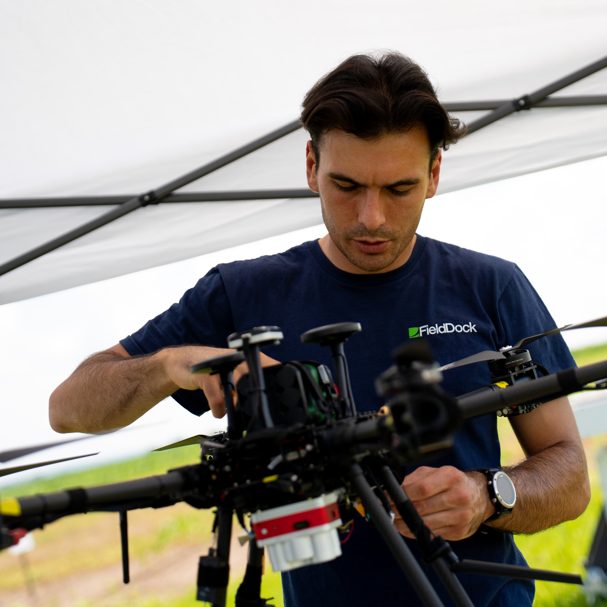

Hi! I am Daniele, an Italian engineer based in the US.

My experience combines two worlds: my agricultural business and my engineering background. I love solving challenging problems and building solutions for them. My entrepreneurial background gives me a clear vision of some of what a real-world application needs, allowing me to bring forward-thinking solutions to the table, especially in agriculture applications.

I am very passionate about designing and building robotics, especially drones, and IoT systems, combining hands-on hardware and software development to deploy end-to-end autonomous systems.

## My Projects

Below is a collection of some of the projects I've worked on.

**My core technical stacks:**
- **Robotics & Autonomy:** ROS2, PX4, MAVLink, QGroundControl, Gazebo
- **Software & Edge ML:** Python, C, OpenCV, PyTorch, TensorFlow, Docker
- **IoT & Hardware:** NVIDIA Jetson, Raspberry Pi, Arduino, ESP32, nRF, AWS, MQTT
- **Fullstack:** Flask, React v19
- **Mechanical & Design:** Fusion360, 3D printing

---

### Crover - Differential PX4 Rover (professional project)

**Overview**
An autonomous rover platform designed for intelligent field navigation, perception, and real-world robotics deployment. Built around ROS 2 and PX4, this project integrates custom vehicle control, lidar sensing, and camera-based perception to enable autonomous operation in agricultural and outdoor environments.

**Key Features**
* Developed a modular autonomous rover stack for sensing, navigation, and control
* Integrated PX4 autopilot with custom control modes for direct speed and steering command execution
* Implemented lidar-assisted row detection and navigation for autonomous traversal through crop rows
* Used camera input for visual perception, object/row detection, and future inspection-based decision making
* Supported both simulation and hardware testing workflows, including SITL/Gazebo and field deployment preparation

**Tech Stack:** C++ | ROS 2 | PX4 | SITL | Gazebo | OpenCV | Python | MAVLink

### Autonomous Drone for a remote drone docking station (professional project)

**Overview:** 
An autonomous drone system designed for intelligent aerial navigation and vision-based precision landing. It integrates Jetson Nano hardware, PX4/MAVLink control, and object detection for autonomous mission execution in real-world field conditions.

**Key Features:**
* Engineered and built custom quadcopter and hexacopter hardware platforms
* Autonomous drone mission control and state handling
* Computer vision-based object detection for landing-pad tracking
* Precision landing logic using camera feedback and flight-controller messaging
* Real-time telemetry publishing for battery, GPS, and mission status

**Tech Stack:** Python | PyMAVLink | Jetson Inference | MQTT | PX4 | SITL | Gazebo

### Kernel-IoT (personal project)

**Overview:**
An autonomous IoT environmental monitoring system designed for remote weather data collection and cloud-based telemetry. It integrates ESP32 hardware, embedded firmware, and wireless communication to measure environmental conditions and transmit data in real-world outdoor deployments.

**Key Features:**
* Designed and deployed a battery-powered ESP32-based monitoring unit
* Implemented autonomous data acquisition from wind, rain, and temperature sensors
* Built wireless telemetry transmission using Wi-Fi with HTTPS and MQTT
* Structured sensor data into JSON payloads with timestamped reporting
* Developed firmware for real-world deployment scenarios with a focus on reliability and low-power operation

**Tech Stack:** C | ESP-IDF | FreeRTOS | Wi-Fi | HTTPS | MQTT

### SoftFarm (professional project)

**Overview**
A full-stack farm intelligence platform designed to collect, process, and visualize agricultural data from multiple field sources. The system integrates a Python-based backend, modular data handlers, and a modern frontend interface to support real-time monitoring, analytics, and operational control for precision agriculture applications.

**Key Features**
* Built a scalable backend for ingesting data from heterogeneous agricultural sources such as PheNode, LoRa testbeds, and FieldDock systems
* Implemented modular data processing pipelines for normalization, storage, and retrieval of sensor and field telemetry
* Developed health monitoring and device-management capabilities for controlling and tracking data handler processes
* Created a cross-platform dashboard experience for viewing maps, charts, and downloadable reports
* Designed the architecture to be extensible for adding new sensors and data providers with minimal rework

**Tech Stack:** Python | Flask | PyMongo | MongoDB | MQTT | React Native | Leaflet

### Horus (professional project)

**Overview:** 
Horus is an embedded edge-computing platform designed for autonomous field monitoring and intelligent visual data acquisition. Built around Raspberry Pi hardware, it integrates camera-based image capture, environmental sensing, and automated data logging to support remote monitoring in real-world outdoor environments.

**Key Features:**
* Designed and deployed an embedded system for agricultural and environmental data collection
* Implemented a camera capture pipeline for high-quality image acquisition and storage
* Integrated BME280 sensor readings for temperature, humidity, and pressure monitoring
* Built automated logging and file organization workflows for daily data capture
* Developed a Linux-based deployment setup with remote monitoring and synchronization support

**Tech Stack:** C++ | Raspberry Pi CM4 | I2C | Linux | MQTT | AWS

